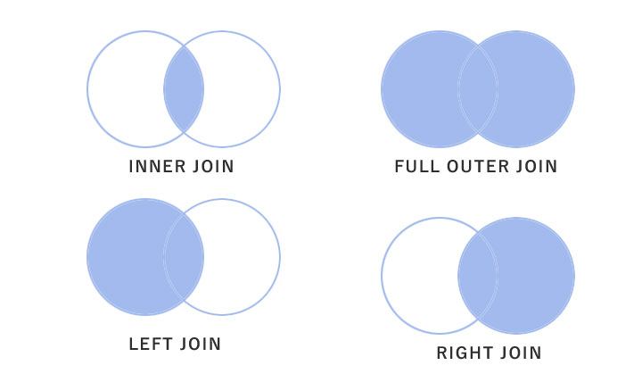

# SQL 100 Knock Study (PostgreSQL)

このリポジトリは、SQLの基礎から応用までを網羅した「SQL100本ノック」の学習記録をまとめたものである。
実務で頻出するデータ抽出・集計・加工のテクニックを中心に学習した。

## 🚀 学習環境
- **Database**: PostgreSQL
- **Focus**: データ分析、統計、レポート作成のためのクエリ作成能力向上

## 📂 コンテンツ構成

### 1-20: 基本操作と文字列操作
- 基本的なデータ抽出（`SELECT`, `WHERE`, `ORDER BY`, `LIMIT`）
- 重複の排除（`DISTINCT`）
- 文字列の結合（`||`）、切り出し（`SUBSTRING`）、検索（`POSITION`）
- 基本的な統計量（`COUNT`, `AVG`, `MAX`, `MIN`）

### 21-40: 高度な文字列・日付操作とDDL
- 正規表現によるパターンマッチング
- ゼロ埋め（`LPAD`）や置換（`REPLACE`）などのデータ整形
- 日付操作（`CURRENT_DATE`, `INTERVAL` による加減算, `DATE_TRUNC`, `EXTRACT`）
- テーブル作成（`CREATE TABLE`）、削除（`DROP`）、レコード挿入（`INSERT`）

### 41-60: 集計・条件分岐・サブクエリ
- レコードの削除・一括削除（`DELETE`, `TRUNCATE`）
- グルーピングとフィルタリング（`GROUP BY`, `HAVING`）
- `CASE`文による条件分岐とフラグ立て
- 標準偏差（`STDDEV`）の算出
- 相関サブクエリとインラインビューを用いたデータ加工

### 61-80: テーブル結合とウィンドウ関数
- 各種結合（`INNER JOIN`, `LEFT JOIN`, `RIGHT JOIN`）の使い分け
- ウィンドウ関数による高度な分析
  - 順位付け（`ROW_NUMBER`, `RANK`, `DENSE_RANK`）
  - 前後の行の参照（`LAG`, `LEAD`）
  - 累計・移動平均（`ROWS BETWEEN` フレーム句）

### 81-100: 応用・分析クエリ
- 共通テーブル式（`WITH`句/CTE）を用いたクエリの構造化
- 集合演算（`UNION`）によるデータ統合
- 複雑なビジネス要件に基づく分析用クエリの作成

## 💡 主要なTips

### JOINの図解

[理解するポイントはここ！ 外部結合と内部結合の違いを図で説明してみた](https://amg-solution.jp/blog/26287) より引用

### SQLの処理順序
1. `FROM` (+ `JOIN`)
2. `WHERE`
3. `GROUP BY`
4. `HAVING`
5. `SELECT`
6. `ORDER BY`
7. `LIMIT`
